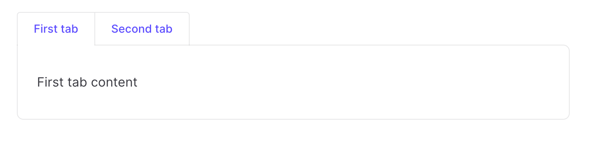

# vitepress-plugin-tabs

VitePress plugin - markdown custom container to display content in tabs.

This project is inspired by [vuepress-plugin-tabs](https://github.com/pskordilakis/vuepress-plugin-tabs), but since vuepress-plugin-tabs is developed for VuePress, I use VitePress, so I wrote one myself.



## Installation

### NPM

```bash
npm i -D @red-asuka/vitepress-plugin-tabs vue3-tabs-component
```

### Yarn

```bash
yarn add -D @red-asuka/vitepress-plugin-tabs vue3-tabs-component
```

### PNPM

```bash
pnpm i -D @red-asuka/vitepress-plugin-tabs vue3-tabs-component
```

Enable plugin in `.vitepress/config.ts`:

```ts
import tabsPlugin from '@red-asuka/vitepress-plugin-tabs'

export default {
  // ...
  markdown: {
    config: (md) => {
      tabsPlugin(md)
    },
  }
}
```

Register component in `.vitepress/theme/index.ts`:

```ts
import { Tab, Tabs } from 'vue3-tabs-component'

export default {
  // ...
  enhanceApp({ app }) {
    app.component('Tab', Tab)
    app.component('Tabs', Tabs)
  }
}
```

If you don't need to customize the style of the tabs, you can directly use the default style provided by `vitepress-plugin-tabs`. You only need to add the following code in `.vitepress/theme/index.ts`:

```ts
import '@red-asuka/vitepress-plugin-tabs/dist/style.css'
```

## Usage

Tab name can be wrapped in double quotes or not.

```md
:::: tabs

::: tab First tab

First tab content

:::

::: tab "Second tab"

Second tab content

:::

::::
```

### Set tab id

```md
:::: tabs

::: tab First tab

First tab content

:::

::: tab "Second tab" id="second-tab"

Second tab content

:::

::::
```

### Set default tab

```md
:::: tabs :options="{ defaultTabHash: 'second-tab' }"

::: tab First tab

First tab content

:::

::: tab "Second tab" id="second-tab"

Second tab content

:::

::::
```

### Set cache

By default, the tab will remember which was the last opened tab within 5 minutes. The cache time can be set by using the `cache-lifetime` attribute, with a unit of minutes.

```md
:::: tabs :cache-lifetime="10"

::: tab First tab

First tab content

:::

::: tab "Second tab"

Second tab content

:::

::::
```

Please refer to the following link for more usage: [vue-tabs-component](https://github.com/Jacobs63/vue3-tabs-component).
